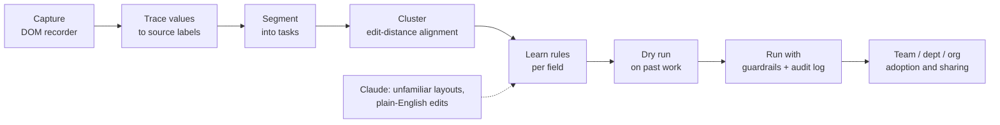

# cl1ck

**cl1ck watches how a team works, finds the work it repeats, and turns it into guarded automations the whole team can run.**

[](https://github.com/PranjolDas10/cl1ck/actions/workflows/ci.yml)


Built solo at the Ramp hackathon.

<!-- Replace with a 30-60s recording of /ledgerline auto-filling a bill and blocking a duplicate. -->


**Live demo:** _add your Vercel URL here_

---

## The problem

Finance teams retype the same invoice data into the same forms hundreds of times a month. Each person builds private shortcuts that never reach the rest of the team, and no one has time to write automation rules by hand.

## What cl1ck does

- **Learns from watching, not configuring.** After two manual bill entries, cl1ck works out where every field came from (for example, "Invoice No." is copied from the line labelled "Invoice #" in the email) and offers to fill all 7 fields next time.
- **Proves itself before it acts.** Every learned workflow is replayed against past work and compared field by field before it can be turned on.
- **Protects money, not just time.** Guardrails block duplicate invoices, hold bills over the team's approval limit or 3x a vendor's average, surface early-payment discounts, and never touch bank details. Every run is audited and can be undone.
- **Scales from one person to the org.** Personal patterns merge into team workflows that can be turned on per team, department or organization, and shared one level at a time.

## How it works

The core is deterministic: string alignment, counting and rule checks, no model calls. Claude is used only in the two places rules can't reach.



| Stage | What happens | Code |
|---|---|---|
| Capture | A generic recorder reads labels, roles and visible text, so the same script could run as a browser extension on apps we don't own. Records field edits with before and after values, copies, pastes, navigation and submits. | [`lib/recorder.ts`](lib/recorder.ts) |
| Trace values | For each typed value, finds the earlier screen it appeared on and the label next to it. This turns clicks into rules without anyone mapping fields. | [`lib/trace.ts`](lib/trace.ts) |
| Segment and cluster | A successful save closes a task; idle gaps reset. Tasks become token sequences grouped by alignment similarity. | [`lib/miner.ts`](lib/miner.ts) |
| Learn rules | Each field is classified as copied from a label, constant, determined by another field (e.g. Vendor decides GL account), or ask a person. Personal and team evidence are merged. | [`lib/miner.ts`](lib/miner.ts) |
| Run | Applies rules to a new email, checks guardrails, writes the bill, logs the run, supports undo. | [`lib/automation.ts`](lib/automation.ts) |
| Team layers | Which groups a workflow covers and how far it may be shared (parent, child or sibling only). | [`lib/groups.ts`](lib/groups.ts) |

## Engineering decisions

- **Deterministic first, LLM second.** Rules are cheap, explainable and testable. Claude handles only (1) invoice layouts the rules have never seen and (2) plain-English rule edits. Both use structured output validated by a Zod schema.
- **The model teaches the rules, then gets out of the way.** When Claude reads an unfamiliar invoice, cl1ck keeps a label only if the deterministic extractor reproduces Claude's value with it. The next invoice from that vendor costs $0.
- **Guardrails are code, not prompts.** Duplicate detection, approval limits and the bank-details ban are plain functions, so a model can never talk its way past them.
- **Alignment over ML for clustering.** Two runs of the same task rarely match exactly (one person copies first, another navigates first). Edit-distance alignment handles that with no training data.
- **Live cross-tab state with no backend.** A small store on `localStorage` plus `useSyncExternalStore` keeps the dashboard and the demo app in sync across tabs in real time.

## Security and privacy

- The recorder never captures password fields, and skips bank, card and identity fields by label and `autocomplete` hint, since third-party apps can't be trusted to mark them. Copy events outside the recorded app are ignored.
- The two API routes validate and size-cap request bodies with Zod, so a public deployment can't be used to run up the API bill with oversized requests.
- Automations can never change bank details or payment destinations; the plain-English editor rejects such requests.
- Standard security headers (`nosniff`, `X-Frame-Options`, `Referrer-Policy`, `Permissions-Policy`) on every route.
- The API key is read server-side only and is never sent to the browser.

## Tour

| Route | What it shows |
|---|---|
| `/` | Landing page: what cl1ck is, how it works in three steps, and a **Try it in 2 minutes** button. |
| `/ledgerline?tour=1` | Guided hands-on tour. You're Dana at a sample coffee company. Enter one invoice (or click "Do it for me"), watch cl1ck learn and take over, then see an impact summary from the real engine. |
| `/dashboard` | What a finance manager sees: workflows per layer, private shortcuts, audit log, live feed. |
| `/personal` | Developer routines. **Watch it run** in the browser; optional Mac (`.command`) or Windows (`.cmd`) downloads. |
| `/sandbox` | Step-by-step walkthrough of the real engine on fixed data. |

## Real vs simulated

**Real:** recorder, value tracing, task segmentation, clustering, rule learning, rule merge, dry run on your own runs, guardrails, audit log and undo, cross-tab live updates, both Claude features.

**Simulated for the demo:** team history (212 runs), teammates and their shortcuts, Finance and Org level patterns, cross-team share results, and other data sources (extension, shell, GitHub). The demo uses a threshold of 2 runs; the spec calls for 5 runs in 60 days at 90% consistency.

## Tech stack

Next.js 16 (App Router), React 19, TypeScript, Tailwind CSS 4, shadcn/ui on Base UI, Zod, Anthropic SDK, Vitest, GitHub Actions.

## Project structure

```
app/                  routes: landing, /dashboard, /ledgerline, /personal, /sandbox, api/
  api/extract/        Claude reads an unfamiliar invoice layout
  api/nl-edit/        Claude turns a sentence into a structured rule edit
components/
  landing/            recruiter-facing home page
  cl1ck/              dashboard UI
  ledgerline/         demo accounting app + tour coach
  personal/           developer-routine demo (Mac + Windows scripts)
  sandbox/            engine walkthrough UI
  ui/                 shadcn primitives
lib/                  the engine (framework-free except the store hook)
  recorder.ts  trace.ts  miner.ts  automation.ts  groups.ts  sandbox.ts
  engine.test.ts      end-to-end test of the pipeline
docs/                 product spec, design notes, demo script
```

## Run locally

Requires Node.js 20.9 or newer.

```bash
git clone https://github.com/PranjolDas10/cl1ck.git
cd cl1ck
npm install
cp .env.example .env.local   # Windows: copy .env.example .env.local
npm run dev
```

Open [http://localhost:3000](http://localhost:3000). Add `CLAUDE_API_KEY` to `.env.local` to enable the two Claude features; everything else works without a key. On `/personal`, **Watch it run** works in any browser; downloadable scripts support both Mac (`.command` / Shortcuts) and Windows (`.cmd` double-click).

| Command | Purpose |
|---|---|
| `npm test` | Run the engine tests |
| `npm run typecheck` | TypeScript check |
| `npm run lint` | ESLint |
| `npm run build` | Production build |

## Deploy

The app deploys to [Vercel](https://vercel.com) with no configuration: import the repository, set `CLAUDE_API_KEY` under Project Settings, Environment Variables, and deploy. Before sharing the URL publicly:

1. Add a Vercel Firewall rate-limit rule on `/api/*` (for example, 10 requests per minute per IP).
2. Set a monthly spend limit in the Anthropic console.

## Docs

- [Product spec](docs/spec.md): the full feature design, data model and metrics
- [Build plan](docs/plan.md): pipeline details and the trade-offs behind them
- [Demo script](docs/demo.md): the 90-second walkthrough
- [Design notes](docs/design.md): visual language

## License

[MIT](LICENSE)
